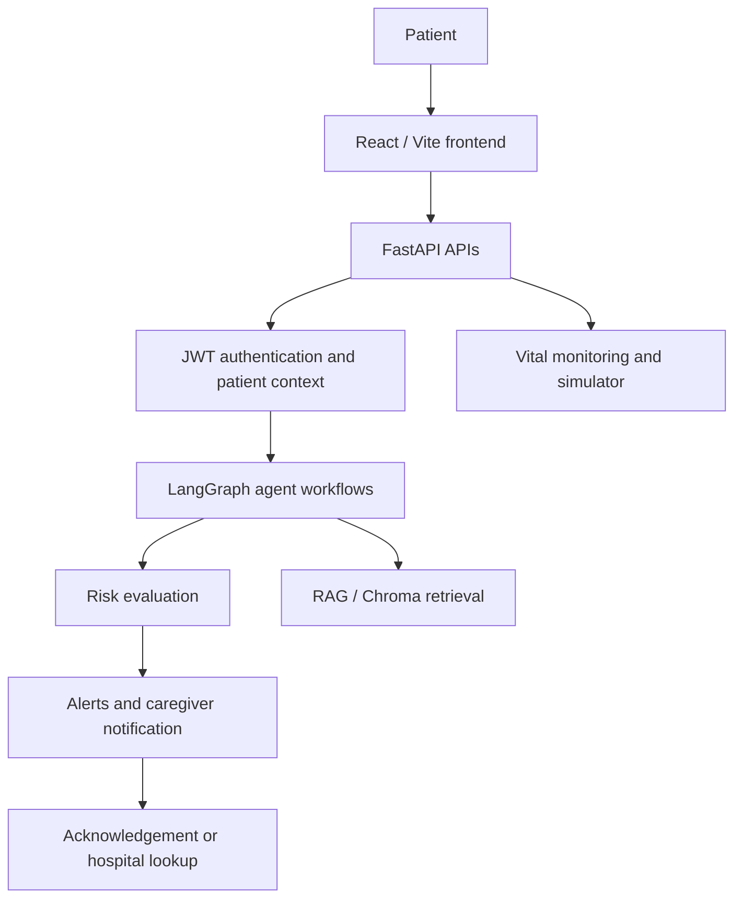
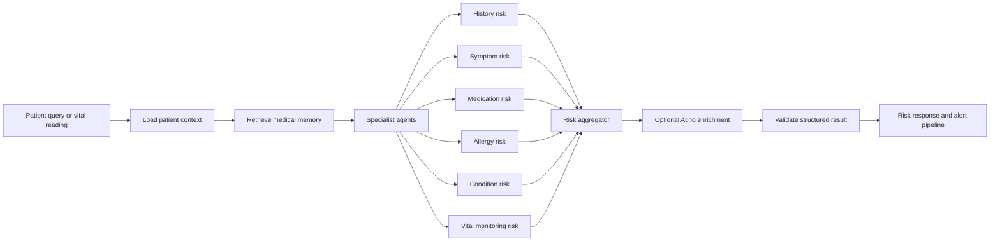

# 🏥 INNOVIK
### Smart Healthcare Assistant & Patient Monitoring System

Innovik is a hackathon/MVP healthcare platform that brings patient context, health assessments, uploaded reports, vital monitoring, risk evaluation, and caregiver escalation into one workflow. Patients can use the React application to manage their profile, complete an assessment, upload medical documents, review health signals, and ask an AI care assistant for general educational guidance. The FastAPI backend keeps patient data scoped to authenticated users and connects monitoring, retrieval, and alert workflows.

<p>
  
  
  
  
  
  
  
  
  
</p>

> **MVP notice:** Innovik is a hackathon project and an engineering demonstration. Risk scores, AI responses, image heuristics, and alerts are not medical diagnoses or a substitute for a qualified clinician or emergency services.

---

## 🚨 The Problem

Patient information is often fragmented across forms, reports, conversations, and isolated measurements. That makes it difficult to maintain medical context, notice changing risk, support medication-related conversations, and communicate clearly with caregivers when a patient needs attention.

Innovik addresses this coordination problem with a patient-scoped record, retrieval of relevant uploaded context, continuous vital monitoring, explainable risk signals, and an escalation path for high-risk readings.

## 💡 Our Solution

Innovik connects a patient-facing application to a FastAPI service, structured health data, a retrieval layer, specialist risk agents, and alert providers:



The repository also contains a separate Express/SQLite server under `smart-healthcare/smart-healthcare/server`. The current Vite client is configured for the FastAPI API at `/api/v1`; the Express server is retained as a separate legacy application surface.

## ✨ Key Features

### 👤 Patient Management

- Patient registration and login through FastAPI endpoints.
- JWT bearer authentication with authenticated patient-scoped access.
- Patient profile and health-assessment workflows.
- Normalized assessment data for basic information, conditions, symptoms, medications, allergies, and additional notes.
- Health-assessment metadata endpoint for building survey forms.

### 💊 Medication Management

- Medication names, dosage, and frequency can be captured in a health assessment.
- Medication information is included in the deterministic medication risk agent.
- Scheduled medication calendars, PRN tracking, adherence reminders, and dose administration workflows are **In Progress**; they are not implemented as a dedicated persistence or reminder subsystem.

### 🧠 AI Healthcare Assistant

The richer backend variant in `backend/` exposes `POST /api/v1/ai-care/chat`. It uses LangChain's `ChatGroq` integration when `GROQ_API_KEY` is configured, with a configurable Groq model, low-temperature prompt-based reasoning, and optional patient-report context retrieved from Chroma.

Responses include whether retrieved context was used, source excerpts when available, the provider/model identifier, and a safety disclaimer. The prompt instructs the assistant not to diagnose, prescribe, invent patient facts, or replace a clinician. The root FastAPI variant does not currently register this route.

### 📚 RAG / Medical Context

The document pipeline supports PDF, plain-text, Markdown, and text uploads on the Python backend:

```text
Documents
	↓
Loading and text extraction
	↓
Overlapping chunking
	↓
Embeddings
	↓
Chroma vector collection
	↓
Patient-filtered similarity search
	↓
Context assembly
	↓
Risk workflow or AI Care response
```

- `pypdf` extracts PDF content; text and Markdown are loaded directly.
- `langchain-text-splitters` handles configurable chunk size and overlap.
- `sentence-transformers/all-MiniLM-L6-v2` is supported when the optional embedding dependency is installed.
- A deterministic hashing embedding fallback supports offline and test environments.
- Patient records are stored in the `patient_records` Chroma collection with patient filtering.
- A `medical_knowledge` collection and ingestion code exist, but no public API route currently invokes general medical-knowledge indexing.

### 📈 Continuous Vital Monitoring

The Python backend includes a controllable simulator and persistence pipeline for:

- Heart rate
- Systolic and diastolic blood pressure
- SpO2
- Temperature
- Glucose

The simulator supports normal, medium, and critical states, as well as gradual deterioration, acute-event, and recovery scenarios. Readings are stored in the database, evaluated through the risk workflow, and passed to alert processing. The dashboard also contains a browser-side display simulation; it is a UI aid and should not be treated as a medical device feed.

### ⚠️ Risk Evaluation & Escalation

Risk evaluation is implemented as a LangGraph workflow. It loads the authenticated patient's assessment, retrieves relevant patient memory, runs specialist evaluators, aggregates findings, optionally incorporates Acno-compatible AI indicators, and validates the final structured result.

The resulting score is an engineering/demo risk signal derived from configured rules and evidence. It is explicitly not a clinical diagnosis.

- Scores below `50`: no alert is created.
- Scores from `50` through `69`: a `SPECIAL_ATTENTION` alert is created.
- Scores of `70` or higher: a high-risk alert is created and caregiver notification is attempted.
- Repeated active alerts are subject to an acknowledgement cooldown.
- An unacknowledged high-risk alert can escalate after the configured timeout.

### 🧑‍⚕️ Caregiver / Emergency Support

Critical readings create an alert and attempt to notify the configured caretaker. Providers are mock-by-default for local development and tests. Optional integrations are present for:

- Twilio SMS, selected through configuration.
- Meta WhatsApp messaging through the WhatsApp provider.
- Hospital lookup through a mock hospital provider in the current Python backend.

Caregivers can acknowledge an alert. If the acknowledgement window expires, the service performs a hospital-provider lookup and records either the result or a no-response state. Notification delivery is best-effort and must be configured before it can reach a real recipient.

### 🩺 Symptom / Image Scanner

The React `Assistant` page includes a camera and image-upload flow for a skin-area scan. It accepts a camera capture or an image file and analyzes sampled pixel brightness, redness, warmth, and color variance in the browser. It returns heuristic labels such as possible redness, darker patch, or uneven tone with explanatory self-care text.

This is not an AI medical-image model and does not diagnose skin conditions. Lighting, camera quality, framing, and normal skin variation can change the result. The separate `ai-service/` directory is marked as future/in-progress rather than a deployed image-analysis service.

## 🤖 Agentic AI Architecture

Innovik is agentic in its risk and memory orchestration: a LangGraph state machine passes patient-scoped input through distinct retrieval, specialist-analysis, aggregation, and validation nodes. The specialist evaluators are primarily deterministic and structured, which makes the demo workflow inspectable and testable.



### Memory Agent

- **Purpose:** Retrieve and organize patient-owned document context.
- **Input:** Authenticated patient ID and a query.
- **Processing:** Queries Chroma with patient filtering and assembles relevant excerpts.
- **Output:** Structured medical context with availability/status information.
- **Connection:** Feeds the risk graph and the richer backend's AI Care service.

### History, Symptom, Medication, Allergy, and Condition Agents

- **Purpose:** Evaluate one category of the patient's structured assessment.
- **Input:** Assessment data and retrieved medical context.
- **Processing:** Apply the category-specific risk rules and collect evidence.
- **Output:** A structured finding with risk level, score, evidence, confidence, and reason.
- **Connection:** Run as the specialist stage of the risk graph and feed the aggregator.

### Vital Monitoring Agent

- **Purpose:** Evaluate the six supported vital measurements and recent readings.
- **Input:** Current and recent heart rate, blood pressure, SpO2, temperature, and glucose readings.
- **Processing:** Compare readings against configured reference ranges and scenario data.
- **Output:** Structured vital-related risk findings.
- **Connection:** Its result is aggregated with the assessment specialists and can trigger alerts.

### Risk Aggregator and Validation Nodes

- **Purpose:** Combine specialist findings into one patient-scoped risk assessment.
- **Input:** Specialist results and optional Acno-compatible provider output.
- **Processing:** Select the overall risk level, score, evidence, indicators, and escalation requirement, then validate the result shape.
- **Output:** A structured `RiskAssessment` used by the API and alert service.
- **Connection:** Hands high-risk results to caregiver notification and escalation.

## 🧠 RAG Architecture

```text
User / Patient Context
		↓
Authenticated query
		↓
Embedding model
		↓
Patient-filtered Chroma vector search
		↓
Relevant document chunks
		↓
Context assembly
		↓
Risk graph or Groq AI Care prompt
		↓
Structured risk result or grounded educational response
```

Uploaded documents are recorded in SQL as patient document metadata and persisted under the configured document storage directory. Extracted text is chunked and indexed in Chroma. Retrieval is limited by top-k, relevance distance, excerpt length, and the authenticated patient's ID so one patient's uploaded reports are not used as another patient's context.

## 🏗️ Architecture and Repository Layout

```text
.
├── main.py                         # Root FastAPI entrypoint shim
├── src/backend/                    # Primary FastAPI package
│   ├── api/routes/                 # Auth, assessments, documents, risk, vitals, alerts
│   ├── agents/risk/                # LangGraph risk workflow and specialists
│   ├── alerts/                     # Notification, acknowledgement, escalation
│   ├── memory/                     # Patient context retrieval workflow
│   ├── rag/                        # Loaders, chunking, embeddings, ingestion
│   ├── models/ and schemas/        # SQLAlchemy models and Pydantic contracts
│   └── vitals/                     # Simulator, schemas, reference ranges
├── tests/                          # Root backend tests
├── backend/                        # Richer backend variant with AI Care and MCP
└── smart-healthcare/smart-healthcare/
	├── client/                     # React/Vite frontend
	├── server/                     # Separate legacy Express/SQLite server
	└── ai-service/                 # Future/in-progress AI service area
```

The `backend/` directory mirrors the Python package and includes additional AI Care wiring plus the standalone MCP server. Choose one Python variant for a given run; both use the same general API and domain model family.

## 🔌 API Surface

The Python API is prefixed with `/api/v1` and exposes:

| Area | Endpoints |
| --- | --- |
| Health | `GET /health` |
| Auth | `POST /auth/register`, `POST /auth/login`, `GET /auth/me` |
| Assessments | Metadata, create, read, update, patch, delete, patient lookup |
| Documents | Upload, list, read, delete |
| Risk | `POST /risk/evaluate` |
| Vitals | Create, latest, history, simulator start/stop/pause/resume/status |
| Alerts | `POST /alerts/{alert_id}/acknowledge` |
| AI Care | `POST /ai-care/chat` in the richer `backend/` variant |

Authenticated routes use `Authorization: Bearer <JWT>` and scope patient records to the authenticated account. FastAPI's generated OpenAPI documentation is available at `/docs` when the service is running.

The richer backend also includes an optional stdio MCP server with read-only tools for health-assessment retrieval and summaries. It does not create patients or assessments.

## 🖥️ Frontend Pages

The React client includes routes for:

- Landing, login, and signup
- Dashboard and vital overview
- Health assessment
- Report upload and document history
- Alerts
- Profile and caretaker information
- AI Care assistant and camera/image heuristic scanner

The Vite development proxy forwards `/api` requests to `http://localhost:8000`. Some client areas remain partial: alert listing currently uses a local placeholder, profile/caretaker updates are persisted client-side, and the dashboard display randomizes values after retrieving a seed reading.

## 🚀 Getting Started

### Prerequisites

- Python 3.13 or newer
- `uv` for Python dependency and environment management
- Node.js and npm for the frontend
- Optional: credentials for Groq, Twilio, WhatsApp, or Acno-compatible integrations

### Run the primary FastAPI backend

```powershell
cd C:\Innvovik
uv sync
uv run uvicorn main:app --reload --port 8000
```

The service is available at `http://localhost:8000`. Check `http://localhost:8000/health` or open the API docs at `http://localhost:8000/docs`.

### Run the richer backend variant

Use this variant when you need the AI Care route or the MCP server:

```powershell
cd C:\Innvovik\backend
uv sync
uv run uvicorn main:app --reload --port 8000
```

The AI Care integration requires `GROQ_API_KEY` and the corresponding optional dependency/configuration. Keep secrets in environment variables or a local ignored `.env`; never commit them.

### Run the React client

```powershell
cd C:\Innvovik\smart-healthcare\smart-healthcare\client
npm install
npm run dev
```

Open `http://localhost:5173` in a browser. For a production build:

```powershell
npm run build
npm run preview
```

### Run tests

```powershell
cd C:\Innvovik
uv run pytest
```

The test suite covers health-assessment validation and persistence, API behavior, memory retrieval, risk evaluation, vitals, MCP tools, survey metadata, and notification behavior.

### Run the separate Express server

```powershell
cd C:\Innvovik\smart-healthcare\smart-healthcare\server
npm install
npm run dev
```

This legacy server listens on port `5000` by default and has its own auth, patient, assessment, upload, and alert routes. Its runtime controllers use SQLite, while `npm run db:init` targets a PostgreSQL initialization path; treat it as a separate application surface rather than the API used by the current Vite client.

## ⚙️ Configuration

Configuration is loaded from environment variables using `pydantic-settings`. The repository includes `.env.example` files for the Python services. Common settings cover:

- Database URL and automatic table creation
- API prefix, CORS origins, and document storage
- JWT secret and token lifetime
- Chroma persistence and embedding configuration
- Alert acknowledgement timeout and caretaker contact
- Optional Groq, Acno, Twilio, and WhatsApp providers

Copy the appropriate example file to a local `.env`, fill in only the values needed for your environment, and keep it untracked. No credentials or token values belong in this repository.

## 🛡️ Safety and Privacy Boundaries

- Risk scores are decision-support signals for this MVP, not diagnoses.
- AI Care provides general education and includes a non-diagnosis disclaimer.
- The image scanner is a browser-side color heuristic, not medical imaging analysis.
- Alert delivery is best-effort and mock-by-default unless providers are configured.
- Patient documents and vectors should be treated as sensitive data; use appropriate access controls, storage protection, retention, and deployment secrets for any real deployment.
- This project has not been presented as a regulated medical device or production clinical system.

## 🧭 Roadmap

The following areas are visible in the repository but are not complete production features:

- Production-grade medication schedules, PRN handling, adherence tracking, and reminders.
- A deployed AI image-analysis service to replace the client-side scanner heuristics.
- Complete persistence-backed profile and caretaker editing in the FastAPI API.
- A fully wired frontend alert list and live monitoring feed.
- Consistent database initialization and deployment documentation for the legacy Express server.
- Production notification providers, hospital integrations, observability, and hardening.

## 📄 License

No license file or SPDX license declaration is currently present in the repository. Add an explicit open-source license before distributing the project as reusable open-source software.
